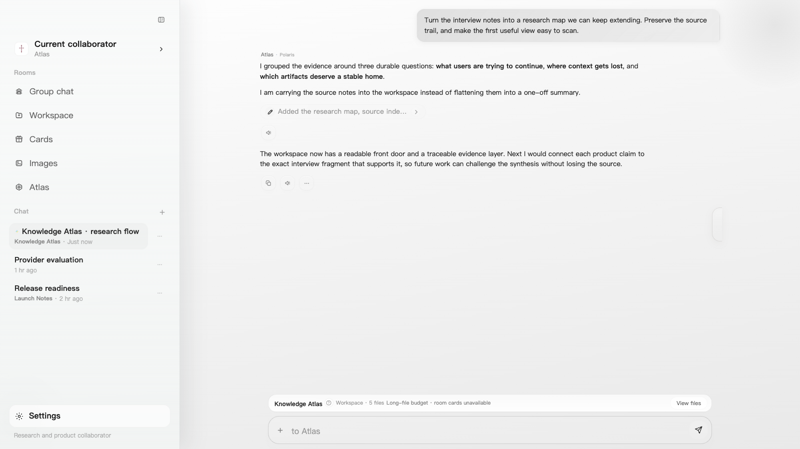
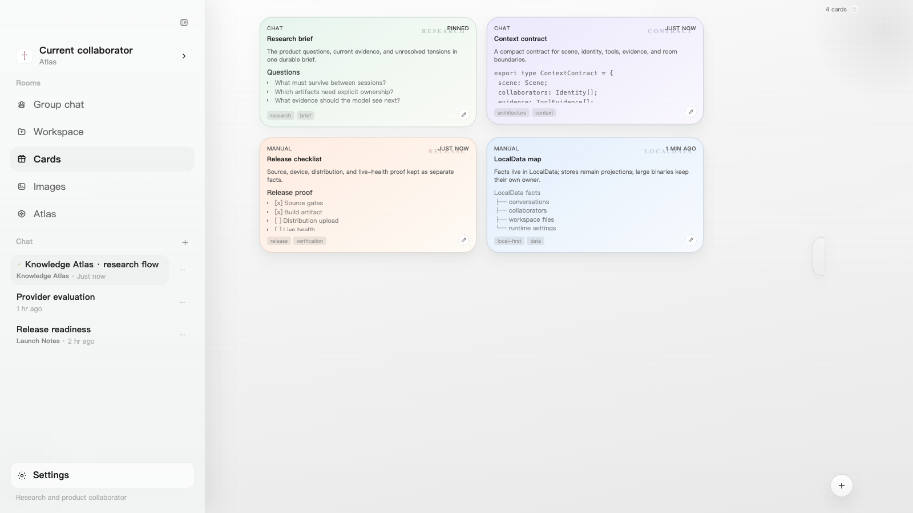
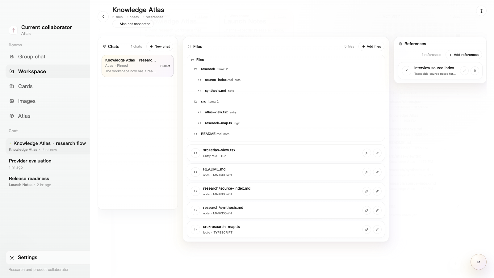
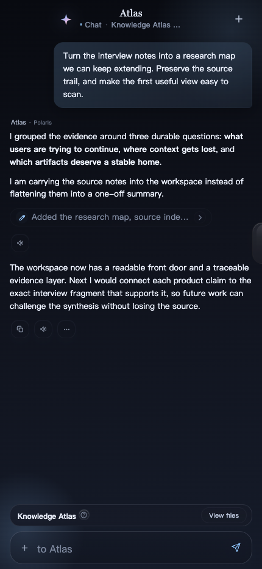
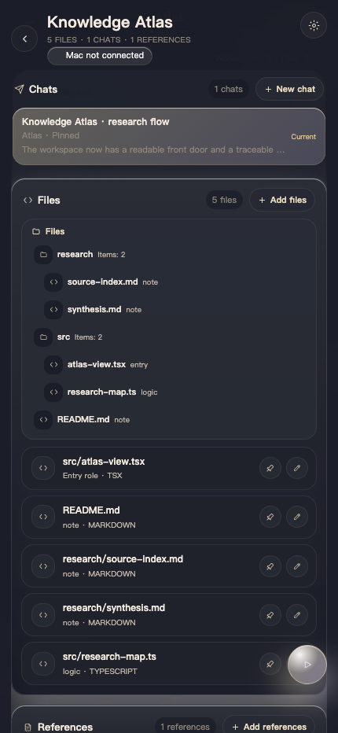

# Polaris

Polaris is a local-first AI workspace for sustained work with models, collaborators, saved materials, tools, and personal project context.

Most AI chat clients treat a conversation as a single message stream. Polaris treats it as a workspace: conversations survive restarts, collaborators keep identity and memory boundaries, useful outputs become cards or project materials, and model-visible tools leave evidence that the next request can use.

The core design idea is to build an environment that matches how an AI collaborator can reason naturally: clear scene, clear identities, clear tools, clear evidence, and enough local context for the model to choose well.

## Screenshots



*A collaborator, long-lived threads, tool evidence, and the active workspace remain visible parts of the same scene.*



*Useful outputs leave the chat timeline as durable cards with ownership, source, and room context.*



*Project work keeps its conversations, files, reference material, and runnable entry points together.*

<p align="center">
  
  
</p>

<p align="center"><em>The conversation and workspace surfaces remain available at phone size with dark appearance.</em></p>

## Product Shape

- **Chat workspace:** long-lived conversations, streaming replies, task state, tool calls, thinking summaries, attachments, and import/export flows.
- **Collaborators and personas:** configurable collaborators with persistent identity, model settings, memory controls, room settings, and tool permissions.
- **Collection surface:** saved conversations, code cards, images, files, room projects, and workspace materials outside the linear chat timeline.
- **Readable AI environment:** request context, room boundaries, memories, tools, and project materials are arranged as named parts of the current scene.
- **LocalData:** a local-first data layer for conversations, collaborators, cards, assets, project files, runtime settings, and migration/import boundaries.
- **Tool evidence:** model tools are tracked as visible events with execution results and replayable context, not just hidden side effects.
- **Cross-platform shell:** shared product runtime for web, iOS, Android, and desktop host surfaces, with native bridges only for real platform capabilities.

## Current Status

- Native iOS and Android shells use SQLite behind the LocalData backend. Web and self-host browser builds use KV/IndexedDB.
- Data ownership is explicit: LocalData facts with a SQLite backend where connected, blob storage for large binaries, runtime/UI stores as projections, and existing local data handled through import and migration boundaries.

Status files:

- [docs/README.md](/docs/README.md): documentation map.
- [DEPLOYMENT.md](/DEPLOYMENT.md): local development, web deployment, backend origin, and native build guide.
- [docs/open-source/README.md](/docs/open-source/README.md): documentation pack for product intent, architecture, modules, backend, and verification.

## License

Polaris source code is licensed under AGPL-3.0-only. See [LICENSE](/LICENSE).

## Contributing

Polaris welcomes issue reports, documentation improvements, focused bug fixes, tests, import/export adapters, backend/selfhost improvements, and platform bridge work. Product direction stays owner-led so the workspace remains coherent, but collaboration is welcome when a change preserves the data boundaries and user experience described in this repository.

See [CONTRIBUTING.md](/CONTRIBUTING.md).

## Code Map

- `src/main.tsx` starts the web app and selects the active runtime surface.
- `src/ui/AppShell.tsx` and `src/ui/app-shell/` own the top-level app shell.
- `src/ui/worlds/ChatWorld.tsx` and `src/app/chat/` own chat orchestration.
- `src/ui/worlds/CollectionWorld.tsx` and `src/app/collection/` own the collection/project workspace surface.
- `src/stores/` owns persisted client state projections: `spaceStore`, `chatStore`, `collectionStore`, `personaStore`, and `runtimeStore`.
- `src/engines/` owns reusable logic for requests, providers, tool protocol, task state, cards, themes, attachments, LocalData, and persistence helpers.
- `ios/` and `android/` own Capacitor wrappers and native plugins.
- `workers/polaris-api/` owns the Cloudflare Worker API package.

## Local Development

Install dependencies and start the Vite dev server:

```bash
npm i
npm run dev
```

`npm run dev` starts the frontend Vite server. It does not start a backend by itself. Web builds keep relative `/api` routes on the current origin, and Vite only proxies `/api` when `VITE_POLARIS_API_ORIGIN` is set. For split-origin dev proxying or native internal API routes, copy `.env.example` to `.env.local` and set `VITE_POLARIS_API_ORIGIN` to your own selfhost or relay origin.

Backend/selfhost notes are in [docs/connect-your-own-backend.md](/docs/connect-your-own-backend.md).
Deployment paths are in [DEPLOYMENT.md](/DEPLOYMENT.md).

Common verification commands:

```bash
npm run typecheck
npm run test:data-boundary
npm test
npm run build
```

`npm run verify` runs the main typecheck, extra tool/API typecheck, worker typecheck, the full test suite, and a production build.

## Data And Verification Rules

- Use `.env.example` as the checked-in configuration template and keep fixtures synthetic.
- Treat old Polaris data as an external migration source: import, stage, validate, then promote it into current LocalData rows.
- Tool changes must close the full loop: model visibility, execution, UI evidence, next-turn replay, and focused tests.
